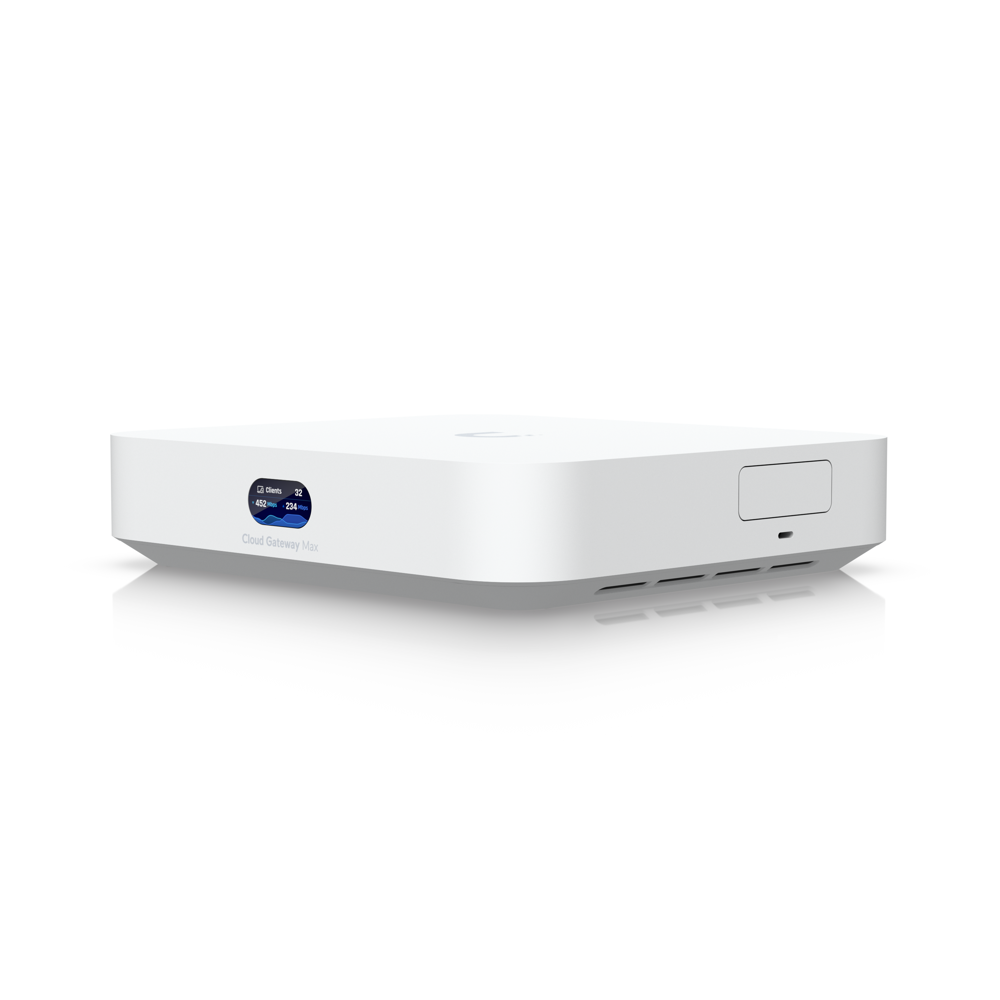
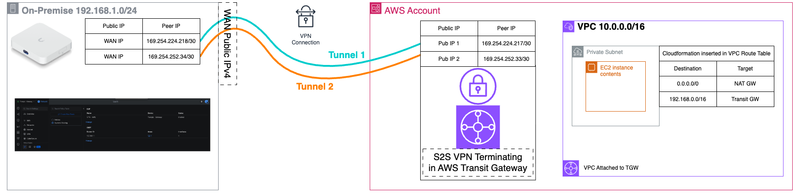
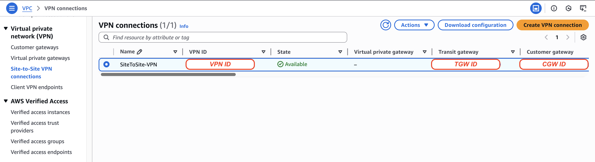
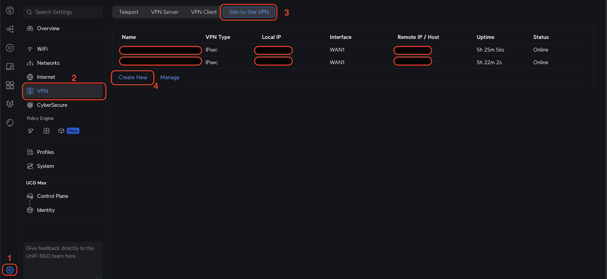
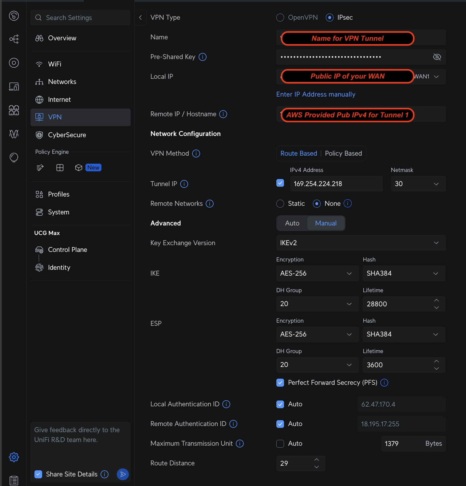
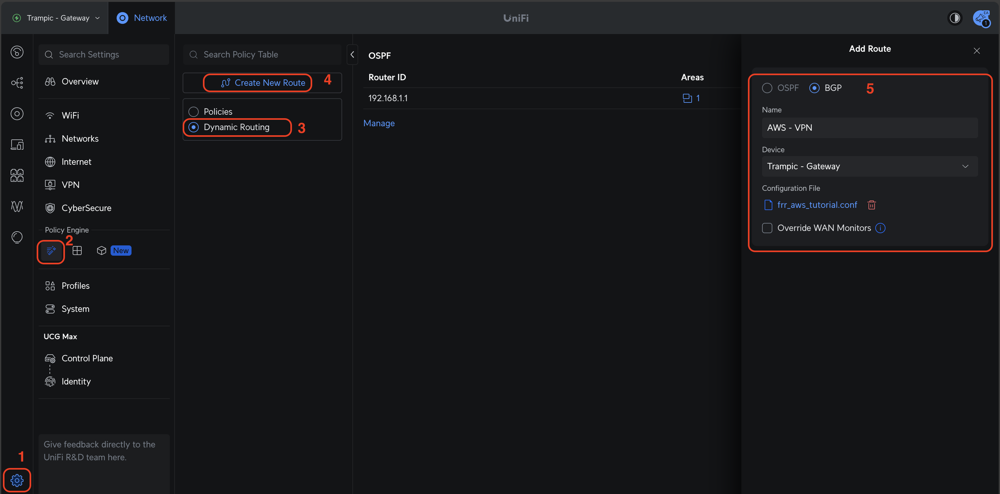
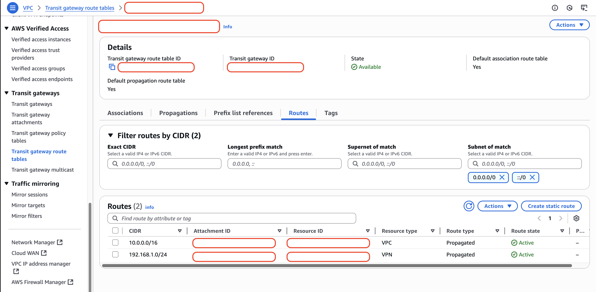

<div style="display: flex; align-items: center; justify-content: center; gap: 20px; margin: 20px 0;">
  
  <div>The UniFi Cloud Gateway Max is a high-performance gateway with advanced routing capabilities, supporting BGP for enterprise-grade network connectivity [1].</div>
</div>

[1] https://techspecs.ui.com/unifi/cloud-gateways/ucg-max?s=us

## Overview

This guide covers setting up a BGP-enabled site-to-site VPN connection between a Ubiquiti UniFi Cloud Gateway Max and AWS using Transit Gateway, enabling dynamic routing and high availability for hybrid cloud connectivity.

## Architecture

Here's what we'll be building - a complete hybrid cloud setup with BGP routing between my home lab and AWS:



> **⚠️ Important Note**: When you download your VPN configuration, AWS will assign unique tunnel IP addresses for your connection. In this guide and screenshots, I'm using:
> - **Tunnel 1**: Customer Gateway `169.254.224.218/30`, Virtual Private Gateway `169.254.224.217/30`
> - **Tunnel 2**: Customer Gateway `169.254.252.34/30`, Virtual Private Gateway `169.254.252.33/30`
> 
> **Make sure to use the actual tunnel IP addresses from YOUR downloaded configuration file**, not the ones shown in my examples.

<div id="lightbox" class="lightbox" onclick="closeLightbox()">
  <span class="lightbox-close">&times;</span>
  
</div>

<script>
function openLightbox(src) {
  document.getElementById('lightbox').style.display = 'block';
  document.getElementById('lightbox-img').src = src;
}

function closeLightbox() {
  document.getElementById('lightbox').style.display = 'none';
}

// Close lightbox with Escape key
document.addEventListener('keydown', function(event) {
  if (event.key === 'Escape') {
    closeLightbox();
  }
});
</script>

## Prerequisites

- **Ubiquiti UniFi Cloud Gateway Max** running UniFi OS 4.3.9 (Official)
- **UniFi Network Application** version 9.4.19
- **AWS account** with appropriate permissions for VPC, Transit Gateway, and VPN operations
- **Basic understanding** of BGP and VPN concepts
- **Public IP address** for my UniFi Gateway
- **Network planning**: 
  - Home lab network: `192.168.1.0/24` (adjust to match your actual range). We assume that Gateway IP is `192.168.1.1`
  - AWS cloud network: `10.0.0.0/8` (RFC1918 private address space)
  - Plan your IP address allocation carefully to avoid conflicts
  - Note: AWS also offers IPAM (IP Address Manager) for complex IP space management, but that's outside the scope of this guide

## Step 1: Deploy AWS Infrastructure

Use this CloudFormation template to create the necessary AWS infrastructure including VPC, Transit Gateway, and Site-to-Site VPN:

```yaml
AWSTemplateFormatVersion: '2010-09-09'
Description: 'Fixed Transit Gateway with Site-to-Site VPN - proper dependencies'

Parameters:
  VpcCidr:
    Type: String
    Default: '10.0.0.0/16'
    Description: CIDR block for the VPC
    
  PublicSubnet1Cidr:
    Type: String
    Default: '10.0.1.0/24'
    Description: CIDR block for the first public subnet
    
  PublicSubnet2Cidr:
    Type: String
    Default: '10.0.2.0/24'
    Description: CIDR block for the second public subnet
    
  PrivateSubnet1Cidr:
    Type: String
    Default: '10.0.3.0/24'
    Description: CIDR block for the first private subnet
    
  PrivateSubnet2Cidr:
    Type: String
    Default: '10.0.4.0/24'
    Description: CIDR block for the second private subnet
    
  OnPremisesCidr:
    Type: String
    Default: '192.168.0.0/16'
    Description: CIDR block for on-premises network
    
  CustomerGatewayIp:
    Type: String
    Description: Public IP address of my customer gateway
    
  BgpAsn:
    Type: Number
    Default: 65000
    Description: BGP ASN for customer gateway
    MinValue: 1
    MaxValue: 4294967294

Resources:
  # VPC and Networking
  VPC:
    Type: AWS::EC2::VPC
    Properties:
      CidrBlock: !Ref VpcCidr
      EnableDnsHostnames: true
      EnableDnsSupport: true
      Tags:
        - Key: Name
          Value: TransitGateway-VPC

  InternetGateway:
    Type: AWS::EC2::InternetGateway
    Properties:
      Tags:
        - Key: Name
          Value: TransitGateway-IGW

  AttachGateway:
    Type: AWS::EC2::VPCGatewayAttachment
    Properties:
      VpcId: !Ref VPC
      InternetGatewayId: !Ref InternetGateway

  # Public Subnets
  PublicSubnet1:
    Type: AWS::EC2::Subnet
    Properties:
      VpcId: !Ref VPC
      CidrBlock: !Ref PublicSubnet1Cidr
      AvailabilityZone: !Select [0, !GetAZs '']
      MapPublicIpOnLaunch: true
      Tags:
        - Key: Name
          Value: Public Subnet 1

  PublicSubnet2:
    Type: AWS::EC2::Subnet
    Properties:
      VpcId: !Ref VPC
      CidrBlock: !Ref PublicSubnet2Cidr
      AvailabilityZone: !Select [1, !GetAZs '']
      MapPublicIpOnLaunch: true
      Tags:
        - Key: Name
          Value: Public Subnet 2

  # Private Subnets
  PrivateSubnet1:
    Type: AWS::EC2::Subnet
    Properties:
      VpcId: !Ref VPC
      CidrBlock: !Ref PrivateSubnet1Cidr
      AvailabilityZone: !Select [0, !GetAZs '']
      Tags:
        - Key: Name
          Value: Private Subnet 1

  PrivateSubnet2:
    Type: AWS::EC2::Subnet
    Properties:
      VpcId: !Ref VPC
      CidrBlock: !Ref PrivateSubnet2Cidr
      AvailabilityZone: !Select [1, !GetAZs '']
      Tags:
        - Key: Name
          Value: Private Subnet 2

  # Elastic IPs for NAT Gateways
  NatGateway1EIP:
    Type: AWS::EC2::EIP
    DependsOn: AttachGateway
    Properties:
      Domain: vpc
      Tags:
        - Key: Name
          Value: NAT Gateway 1 EIP

  NatGateway2EIP:
    Type: AWS::EC2::EIP
    DependsOn: AttachGateway
    Properties:
      Domain: vpc
      Tags:
        - Key: Name
          Value: NAT Gateway 2 EIP

  # NAT Gateways
  NatGateway1:
    Type: AWS::EC2::NatGateway
    Properties:
      AllocationId: !GetAtt NatGateway1EIP.AllocationId
      SubnetId: !Ref PublicSubnet1
      Tags:
        - Key: Name
          Value: NAT Gateway 1

  NatGateway2:
    Type: AWS::EC2::NatGateway
    Properties:
      AllocationId: !GetAtt NatGateway2EIP.AllocationId
      SubnetId: !Ref PublicSubnet2
      Tags:
        - Key: Name
          Value: NAT Gateway 2

  # Route Tables
  PublicRouteTable:
    Type: AWS::EC2::RouteTable
    Properties:
      VpcId: !Ref VPC
      Tags:
        - Key: Name
          Value: Public Route Table

  PrivateRouteTable1:
    Type: AWS::EC2::RouteTable
    Properties:
      VpcId: !Ref VPC
      Tags:
        - Key: Name
          Value: Private Route Table 1

  PrivateRouteTable2:
    Type: AWS::EC2::RouteTable
    Properties:
      VpcId: !Ref VPC
      Tags:
        - Key: Name
          Value: Private Route Table 2

  # Public Route
  PublicRoute:
    Type: AWS::EC2::Route
    DependsOn: AttachGateway
    Properties:
      RouteTableId: !Ref PublicRouteTable
      DestinationCidrBlock: 0.0.0.0/0
      GatewayId: !Ref InternetGateway

  # Private Routes to NAT Gateways
  PrivateRoute1:
    Type: AWS::EC2::Route
    Properties:
      RouteTableId: !Ref PrivateRouteTable1
      DestinationCidrBlock: 0.0.0.0/0
      NatGatewayId: !Ref NatGateway1

  PrivateRoute2:
    Type: AWS::EC2::Route
    Properties:
      RouteTableId: !Ref PrivateRouteTable2
      DestinationCidrBlock: 0.0.0.0/0
      NatGatewayId: !Ref NatGateway2

  # Subnet Route Table Associations
  PublicSubnet1RouteTableAssociation:
    Type: AWS::EC2::SubnetRouteTableAssociation
    Properties:
      SubnetId: !Ref PublicSubnet1
      RouteTableId: !Ref PublicRouteTable

  PublicSubnet2RouteTableAssociation:
    Type: AWS::EC2::SubnetRouteTableAssociation
    Properties:
      SubnetId: !Ref PublicSubnet2
      RouteTableId: !Ref PublicRouteTable

  PrivateSubnet1RouteTableAssociation:
    Type: AWS::EC2::SubnetRouteTableAssociation
    Properties:
      SubnetId: !Ref PrivateSubnet1
      RouteTableId: !Ref PrivateRouteTable1

  PrivateSubnet2RouteTableAssociation:
    Type: AWS::EC2::SubnetRouteTableAssociation
    Properties:
      SubnetId: !Ref PrivateSubnet2
      RouteTableId: !Ref PrivateRouteTable2

  # Transit Gateway
  TransitGateway:
    Type: AWS::EC2::TransitGateway
    Properties:
      AmazonSideAsn: 64512
      Description: Transit Gateway for Site-to-Site VPN
      DefaultRouteTableAssociation: enable
      DefaultRouteTablePropagation: enable
      DnsSupport: enable
      VpnEcmpSupport: enable
      Tags:
        - Key: Name
          Value: S2S-TransitGateway

  # Transit Gateway VPC Attachment
  TransitGatewayVpcAttachment:
    Type: AWS::EC2::TransitGatewayVpcAttachment
    Properties:
      TransitGatewayId: !Ref TransitGateway
      VpcId: !Ref VPC
      SubnetIds:
        - !Ref PrivateSubnet1
        - !Ref PrivateSubnet2
      Tags:
        - Key: Name
          Value: VPC-Attachment

  # Customer Gateway for Site-to-Site VPN
  CustomerGateway:
    Type: AWS::EC2::CustomerGateway
    Properties:
      Type: ipsec.1
      BgpAsn: !Ref BgpAsn
      IpAddress: !Ref CustomerGatewayIp
      Tags:
        - Key: Name
          Value: OnPremises-CustomerGateway

  # Site-to-Site VPN Connection
  VpnConnection:
    Type: AWS::EC2::VPNConnection
    Properties:
      Type: ipsec.1
      StaticRoutesOnly: false
      CustomerGatewayId: !Ref CustomerGateway
      TransitGatewayId: !Ref TransitGateway
      Tags:
        - Key: Name
          Value: SiteToSite-VPN

  # Routes in private route tables to Transit Gateway
  # FIXED: Now depends on TransitGatewayVpcAttachment instead of just TransitGateway
  PrivateRouteToTgw1:
    Type: AWS::EC2::Route
    DependsOn: TransitGatewayVpcAttachment
    Properties:
      RouteTableId: !Ref PrivateRouteTable1
      DestinationCidrBlock: !Ref OnPremisesCidr
      TransitGatewayId: !Ref TransitGateway

  PrivateRouteToTgw2:
    Type: AWS::EC2::Route
    DependsOn: TransitGatewayVpcAttachment
    Properties:
      RouteTableId: !Ref PrivateRouteTable2
      DestinationCidrBlock: !Ref OnPremisesCidr
      TransitGatewayId: !Ref TransitGateway

Outputs:
  VpcId:
    Description: VPC ID
    Value: !Ref VPC
    Export:
      Name: !Sub '${AWS::StackName}-VPC-ID'

  TransitGatewayId:
    Description: Transit Gateway ID
    Value: !Ref TransitGateway
    Export:
      Name: !Sub '${AWS::StackName}-TGW-ID'

  VpnConnectionId:
    Description: Site-to-Site VPN Connection ID
    Value: !Ref VpnConnection
    Export:
      Name: !Sub '${AWS::StackName}-VPN-ID'

  CustomerGatewayId:
    Description: Customer Gateway ID
    Value: !Ref CustomerGateway
    Export:
      Name: !Sub '${AWS::StackName}-CGW-ID'

  ConfigurationInstructions:
    Description: Next steps for configuration
    Value: |
      1. Download VPN configuration from Site-to-Site VPN connection
      2. Configure my on-premises router with BGP settings
      3. Test connectivity between networks (192.168.0.0/16 <-> 10.0.0.0/16)
      4. Both NAT Gateways provide redundancy for private subnet internet access
```

## Step 2: Download VPN Configuration

After the CloudFormation stack deploys successfully, navigate to the AWS Console and download the VPN configuration:

1. Go to **VPC** → **Site-to-Site VPN Connections**
2. Select my VPN connection
3. Click **Download Configuration**
4. Choose **Generic** as the vendor and download the configuration file



> **⚠️ Important Note**: When you download your VPN configuration, AWS will assign unique tunnel IP addresses for your connection. In this guide and screenshots, I'm using:
> - **Tunnel 1**: Customer Gateway `169.254.224.218/30`, Virtual Private Gateway `169.254.224.217/30`
> - **Tunnel 2**: Customer Gateway `169.254.252.34/30`, Virtual Private Gateway `169.254.252.33/30`
> 
> **Make sure to use the actual tunnel IP addresses from YOUR downloaded configuration file**, not the ones shown in my examples.

## Step 3: Configure UniFi Cloud Gateway Max

Now that the AWS infrastructure is deployed and you have the VPN configuration file, it's time to configure the UniFi side.

### Create Site-to-Site VPN in UniFi Console

1. **Access UniFi Console** and navigate to **Settings** → **VPN**
2. **Create new Site-to-Site VPN connection**:



3. **Configure VPN parameters** using the details from my downloaded AWS VPN configuration:



Key configuration points:
- **VPN Type**: IPSec
- **Name**: Use AWS VPN connection ID (e.g., `vpn-xxxxxxxxx-xxx-Tun-1`)
- **Pre-shared Key**: From the AWS VPN configuration file
- **Local IP**: My public IP (e.g., `x.x.x.x`)
- **Remote IP/Hostname**: AWS tunnel endpoint (e.g., `x.x.x.x`)
- **VPN Method**: Route Based
- **Tunnel IP**: Customer Gateway tunnel IP (e.g., `169.254.224.218/30`)
- **Key Exchange Version**: IKEv2
- **IKE Encryption**: AES-256
- **IKE Hash**: SHA384
- **IKE DH Group**: 20
- **IKE Lifetime**: 28800
- **ESP Encryption**: AES-256
- **ESP Hash**: SHA384
- **ESP DH Group**: 20
- **ESP Lifetime**: 3600
- **Local Authentication ID**: My public IP
- **Remote Authentication ID**: AWS tunnel endpoint IP
- **MTU**: 1379 bytes
- **Route Distance**: 29

### Configure BGP Dynamic Routing

After creating the VPN connection, I need to configure BGP for dynamic routing between my home lab and AWS.

1. **Create BGP configuration** using the following FRR configuration:

> **📝 Note**: Save this configuration to a file (e.g., `frr_aws_tutorial.conf`) as we'll upload it to the UniFi Console in the next step.

```bash
frr defaults datacenter
!
router bgp 65000
 bgp router-id 192.168.1.1

 ! --- AWS TUNNEL 1 (PRIMARY) ---
 neighbor 169.254.224.217 remote-as 64512
 neighbor 169.254.224.217 description AWS-Tunnel1-PRIMARY
 neighbor 169.254.224.217 timers 10 30

 ! --- AWS TUNNEL 2 (BACKUP) ---
 neighbor 169.254.252.33 remote-as 64512
 neighbor 169.254.252.33 description AWS-Tunnel2-BACKUP
 neighbor 169.254.252.33 timers 10 30

 address-family ipv4
  ! Advertise on-prem network(s) to AWS
  network 192.168.1.0 mask 255.255.255.0

  ! PRIMARY neighbor policy
  neighbor 169.254.224.217 activate
  neighbor 169.254.224.217 soft-reconfiguration inbound
  neighbor 169.254.224.217 route-map IN-PRIMARY in
  neighbor 169.254.224.217 route-map OUT-PRIMARY out

  ! BACKUP neighbor policy
  neighbor 169.254.252.33 activate
  neighbor 169.254.252.33 soft-reconfiguration inbound
  neighbor 169.254.252.33 route-map IN-BACKUP in
  neighbor 169.254.252.33 route-map OUT-BACKUP out
 exit-address-family
!
! ---- Place route-maps (and any prefix-lists) *after* router bgp on UniFi ----
!
! Inbound from AWS — prefer PRIMARY via higher local-pref
route-map IN-PRIMARY permit 10
 set local-preference 200
!
route-map IN-BACKUP permit 10
 ! default local-pref = 100
!
! Outbound to AWS — no change on PRIMARY
route-map OUT-PRIMARY permit 10
!
! Outbound to AWS — prepend on BACKUP so AWS prefers PRIMARY towards you
route-map OUT-BACKUP permit 10
 set as-path prepend 65000 65000
!
```

2. **Navigate to Dynamic Routing** in the UniFi Console:




This configuration:
- Sets up BGP peering with both AWS tunnel endpoints
- Configures tunnel 1 as primary and tunnel 2 as backup
- Advertises my home network (192.168.1.0/24) to AWS
- Uses route-maps to prefer the primary tunnel for traffic in both directions

## Validation

Once the BGP configuration is complete, you can validate that routing is working correctly in the AWS Console. Navigate to **VPC** → **Transit Gateways** → **Route Tables** to see the learned routes from your home lab:



You should see your home lab network (192.168.1.0/24) appearing as a propagated route with the VPN attachment as the target. This confirms that BGP is successfully advertising your on-premises network to AWS.

## Troubleshooting

Common issues and solutions when establishing BGP peering between UniFi and AWS:

### Check VPN Tunnel Status

First, verify that the IPSec tunnels are established:

```bash
# SSH to UniFi Gateway and test connectivity to AWS tunnel endpoints
ping 169.254.224.217
ping 169.254.252.33
```

### BGP Status and Debugging

Check BGP neighbor status and route exchange:

```bash
# Access FRR shell on UniFi Gateway
vtysh

# The following commands should be executed within vtysh session
# or as single commands: vtysh -c "command"

# Check BGP summary - shows neighbor status and route counts
show ip bgp summary

# Check specific neighbor details
show ip bgp neighbors 169.254.224.217

# View routes being advertised to AWS
show ip bgp neighbors 169.254.224.217 advertised-routes

# View routes received from AWS
show ip bgp neighbors 169.254.224.217 received-routes

# Check BGP routing table
show ip bgp

# Check if specific route is in BGP table
show ip bgp 192.168.1.0/24
```

### Route Advertisement Issues

If routes aren't being advertised or received:

```bash
# Execute within vtysh session or as vtysh -c "command"

# Check if BGP neighbor is activated
show running-config
# Look for "neighbor X.X.X.X activate" under address-family ipv4

# Clear BGP session to refresh routes
clear ip bgp 169.254.224.217 soft out

# Check local routing table
show ip route

# Verify route-maps are applied correctly
show route-map ALLOW-ALL
```

### Common Configuration Issues

1. **BGP neighbor not activated**: Ensure `neighbor X.X.X.X activate` is configured under `address-family ipv4`

2. **Routes not advertised**: Check if you have either:
   - `network 192.168.1.0/24` statement, or
   - `redistribute connected` with appropriate route-maps

3. **Routes received but not installed**: Usually indicates:
   - Better route exists in routing table
   - Next-hop not reachable
   - Inbound route-map blocking routes

4. **No BGP instance found**: BGP configuration not loaded properly - restart FRR or check integrated config

### AWS Side Verification

Check AWS console for:
- VPN connection status (both tunnels should show "UP")
- Route propagation enabled on route tables
- Security groups allowing traffic from on-premises CIDR
- Transit Gateway route tables have proper associations and propagations

### Service Status Commands

```bash
# Check FRR service status
systemctl status frr

# View FRR logs
journalctl -u frr -f

# Restart FRR if needed
systemctl restart frr
```

## Conclusion

This setup provides several key benefits for hybrid cloud connectivity:

**Dynamic Routing**: BGP automatically handles route updates, eliminating the need for manual static route management when networks change.

**High Availability**: With dual tunnels and route-maps, traffic automatically fails over to the backup tunnel if the primary fails, ensuring continuous connectivity.

**Scalability**: The Transit Gateway architecture allows easy addition of more VPCs, VPN connections, or Direct Connect gateways as your infrastructure grows.

**Cost Efficiency**: Using your existing UniFi Gateway Max eliminates the need for additional hardware while providing enterprise-grade VPN capabilities.

With this configuration, my home lab now has seamless, resilient connectivity to AWS with automatic failover and dynamic routing - perfect for hybrid cloud workloads, development environments, and secure access to cloud resources.
