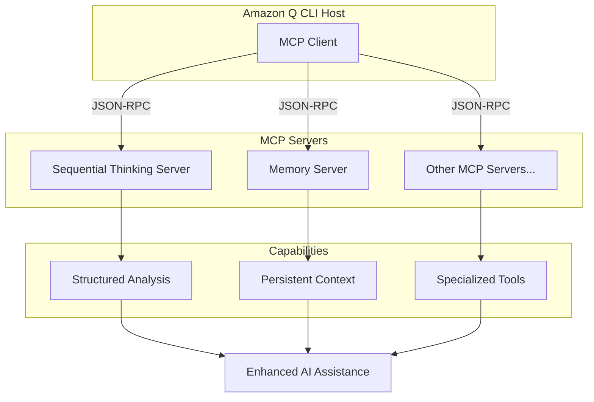

## Introduction

Amazon Q CLI's extensibility through Model Context Protocol (MCP) servers opens up powerful possibilities for enhanced AI assistance. While Amazon Q provides excellent baseline capabilities, MCP servers can add specialized tools that transform how you interact with AI. Two particularly valuable MCP servers are sequential thinking and memory tools, which bring structured reasoning and persistent context to your AI workflows.

This post explores how these MCP servers work, their practical benefits, and real-world usage examples that demonstrate their impact on problem-solving and content creation.

## Understanding Model Context Protocol (MCP)

The Model Context Protocol is an open standard that enables AI applications to connect with external data sources and tools through a standardized interface. Think of MCP as a universal adapter system—like USB-C for AI applications—that allows different tools and services to plug into your AI assistant seamlessly.



### Key MCP Concepts

**MCP Servers** provide specialized capabilities like tools, resources, or prompts to AI applications. They run as separate processes and communicate via JSON-RPC.

**MCP Clients** (like Amazon Q CLI) connect to these servers and make their capabilities available to the AI model and user.

**Protocol Features** include:
- **Tools**: Executable functions the AI can invoke
- **Resources**: Data sources the AI can access
- **Prompts**: Pre-defined templates for common tasks
- **Sampling**: Ability for servers to request AI generations

## Sequential Thinking Tool: Structured Problem Solving

The sequential thinking MCP server adds a powerful capability to break down complex problems into logical, step-by-step analysis. Instead of jumping to conclusions, it forces structured reasoning through multi-step thought processes.

### How Sequential Thinking Works

When you encounter a complex problem, the sequential thinking tool:

1. **Breaks down the problem** into manageable components
2. **Analyzes each step** systematically 
3. **Builds understanding progressively** from simple to complex
4. **Allows course correction** as new insights emerge
5. **Provides transparent reasoning** you can follow and verify

### Real-World Example: Python Code Optimization

Here's how sequential thinking helped optimize a Python data processing script:

**Problem**: Python script processing 1M records takes 45 minutes, needs to run in under 5 minutes

**Sequential Analysis**:
1. **Performance Profiling**: Identify bottlenecks using cProfile - found 80% time in database queries
2. **Root Cause Analysis**: Individual SELECT queries in loop vs batch operations
3. **Solution Evaluation**: Compare batch queries, connection pooling, async processing, and caching
4. **Implementation Strategy**: Start with batch queries (highest impact), then add connection pooling
5. **Optimization Results**: Batch queries reduced time to 8 minutes, connection pooling to 3 minutes

```python
# Before: Individual queries (slow)
for record_id in record_ids:
    result = cursor.execute("SELECT * FROM table WHERE id = ?", (record_id,))
    process_record(result.fetchone())

# After: Batch processing (fast)
placeholders = ','.join(['?' for _ in record_ids])
results = cursor.execute(f"SELECT * FROM table WHERE id IN ({placeholders})", record_ids)
for record in results.fetchall():
    process_record(record)
```

This structured approach identified the real bottleneck and prioritized solutions by impact.

### Benefits for Development Work

- **Complex Architecture Decisions**: Break down technology choices systematically
- **Debugging**: Methodically eliminate potential causes
- **Code Reviews**: Analyze code quality through multiple dimensions
- **Planning**: Structure project planning with logical dependencies
- **Learning**: Understand new technologies step-by-step

## Memory Tool: Persistent Context and Learning

The memory MCP server provides persistent storage for information across conversations, enabling the AI to remember preferences, patterns, and context that would otherwise be lost between sessions.

### Memory Capabilities

**Entity Storage**: Store structured information about people, projects, technologies, and concepts with rich metadata and observations.

**Relationship Mapping**: Create connections between entities to understand how concepts relate to each other.

**Context Retrieval**: Automatically surface relevant information from previous conversations and interactions.

**Pattern Recognition**: Build understanding of user preferences and successful approaches over time.

### Practical Memory Usage

In our blog co-authoring workflow, memory stores:

- **User Preferences**: Writing style, technical depth, target audience
- **Content Patterns**: Successful post structures and approaches  
- **Technical Context**: Project configurations, tool versions, common issues
- **Relationship Maps**: How different blog posts and topics connect

### Example: Building Content Continuity

When planning this MCP blog post, memory provided:

```
Previous Context: Amazon Q CLI agents post exists
User Preference: Technical accuracy with practical examples
Content Gap: No coverage of MCP servers specifically
Relationship: This post complements existing Amazon Q content
```

This context ensures new content builds on existing work rather than duplicating it.

## Integration Benefits: Sequential Thinking + Memory

The real power emerges when these tools work together:

### Enhanced Problem Solving

**Sequential thinking** provides structured analysis while **memory** maintains context about:
- Previous similar problems and solutions
- User preferences for troubleshooting approaches
- Successful patterns and methodologies
- Project-specific constraints and requirements

### Improved Content Creation

For blog writing:
- **Sequential thinking** structures content planning and ensures comprehensive coverage
- **Memory** maintains consistency with previous posts and remembers successful formats
- Together they enable building content series and maintaining voice consistency

### Learning and Adaptation

- **Sequential thinking** breaks down complex topics for better understanding
- **Memory** stores insights and successful approaches for future reference
- The combination creates a learning system that improves over time

## Configuration and Setup

### MCP Server Configuration

Add MCP servers to your Amazon Q CLI configuration:

```json
{
  "mcpServers": {
    "sequential-thinking": {
      "command": "npx",
      "args": ["-y", "@modelcontextprotocol/server-sequential-thinking"]
    },
    "memory": {
      "command": "npx", 
      "args": ["-y", "@modelcontextprotocol/server-memory"],
      "env": {
        "MEMORY_FILE_PATH": "/path/to/your/memory.json"
      }
    }
  }
}
```

### Memory Persistence Across Environments

The memory MCP server persists data to a JSON file, enabling continuity across different environments:

- **Local Development**: Store in project directory for version control
- **DevContainers**: Mount memory files as volumes to persist across container rebuilds
- **Team Collaboration**: Share memory files to maintain consistent context across team members
- **Environment-Specific**: Use different memory files for development, staging, and production contexts

Example memory file paths:
```bash
# Project-specific memory
/workspace/.memory/project-assistant.json

# User-specific memory  
~/.memory/personal-assistant.json

# Environment-specific memory
/data/memory/staging-assistant.json
```

### Agent Integration

Reference MCP capabilities in your agent configurations:

```json
{
  "name": "mcp-demo-assistant",
  "description": "Demo assistant showcasing MCP sequential thinking and memory capabilities",
  "prompt": "You MUST use sequential thinking for complex analysis and memory for persistent context. Your memory persists to /home/vscode/.memory/mcp-demo-assistant.json.",
  "mcpServers": {
    "sequential-thinking": {
      "command": "npx",
      "args": ["-y", "@modelcontextprotocol/server-sequential-thinking"]
    },
    "memory": {
      "command": "npx",
      "args": ["-y", "@modelcontextprotocol/server-memory"],
      "env": {
        "MEMORY_FILE_PATH": "/home/vscode/.memory/mcp-demo-assistant.json"
      }
    }
  },
  "tools": [
    "@sequential-thinking",
    "@memory"
  ],
  "allowedTools": [
    "@sequential-thinking", 
    "@memory"
  ]
}
```

## Best Practices and Usage Patterns

### When to Use Sequential Thinking

- **Complex technical decisions** requiring multiple factors
- **Debugging** multi-layered problems
- **Planning** projects with dependencies
- **Analysis** of unfamiliar technologies or concepts
- **Content creation** requiring structured coverage

### Memory Management Strategies

- **Store user preferences** early in relationships
- **Create entities** for important projects and technologies
- **Build relationships** between related concepts
- **Regular cleanup** of outdated information
- **Search before creating** to avoid duplicates

### Integration Workflows

1. **Start complex tasks** with sequential thinking to structure approach
2. **Check memory** for relevant context and previous solutions
3. **Store insights** and successful patterns for future reference
4. **Build relationships** between new and existing knowledge

## Real-World Impact

### Development Productivity

- **Faster problem resolution** through systematic analysis
- **Better decision making** with structured evaluation
- **Improved learning** through persistent knowledge building
- **Enhanced collaboration** with transparent reasoning

### Content Quality

- **More comprehensive coverage** through structured planning
- **Better consistency** across related content
- **Reduced duplication** through memory-based context checking
- **Improved reader experience** with logical flow and progression

## Future Possibilities

The MCP ecosystem continues expanding with new servers for:

- **Code analysis** and refactoring assistance
- **Database integration** for dynamic data access
- **API connectivity** for real-time information
- **Specialized domain knowledge** for specific industries
- **Collaborative workflows** for team environments

## Conclusion

Sequential thinking and memory MCP servers transform Amazon Q CLI from a capable AI assistant into a sophisticated reasoning and learning system. Sequential thinking brings methodical analysis to complex problems, while memory provides the continuity needed for long-term collaboration and learning.

Together, they create an AI partnership that gets better over time, remembers your preferences and patterns, and approaches problems with the systematic rigor of an experienced colleague. Whether you're debugging complex systems, planning technical projects, or creating comprehensive content, these tools provide the structure and persistence that make AI assistance truly valuable.

The Model Context Protocol's extensible architecture means this is just the beginning. As more specialized MCP servers emerge, the possibilities for enhanced AI assistance will continue expanding, making our development workflows more efficient and our problem-solving more effective.

**Ready to enhance your Amazon Q CLI setup?** Start by adding sequential thinking and memory servers to your configuration, then experiment with how structured reasoning and persistent context can improve your daily workflows.

---

*This post was co-authored by Mladen Trampic and Amazon Q Developer CLI, demonstrating the collaborative approach to technical content creation enhanced by MCP tools.*
