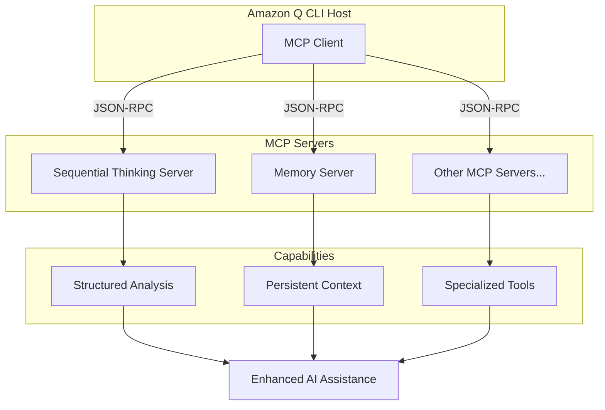

## Introduction



Just like the classic "Exact Instructions Challenge" demonstrates the importance of precise, unambiguous directions, MCP servers require detailed agent configuration and explicit workflow guidance to function predictably. Without clear specifications, AI agents—like the students in the video—will interpret instructions in unexpected ways.

Amazon Q CLI's Model Context Protocol (MCP) servers transform generic AI assistance into deterministic, workflow-driven tools. But this power comes with responsibility: you must define exact agent behaviors, mandatory step sequences, and strict prohibitions to ensure consistent results.

Two particularly valuable MCP servers are sequential thinking and memory tools, which bring structured reasoning and persistent context to your AI workflows—but only when properly configured with explicit instructions and workflow requirements.

This post explores how these MCP servers work, their practical benefits, and real-world usage examples that demonstrate their impact on problem-solving and content creation.

## Understanding Model Context Protocol (MCP)

The Model Context Protocol is an open standard that enables AI applications to connect with external data sources and tools through a standardized interface. Think of MCP as a universal adapter system—like USB-C for AI applications—that allows different tools and services to plug into your AI assistant seamlessly.



### Key MCP Concepts

**MCP Servers** provide specialized capabilities like tools, resources, or prompts to AI applications. They run as separate processes and communicate via JSON-RPC.

**MCP Clients** (like Amazon Q CLI) connect to these servers and make their capabilities available to the AI model and user.

**Protocol Features** include:
- **Tools**: Executable functions the AI can invoke
- **Resources**: Data sources the AI can access
- **Prompts**: Pre-defined templates for common tasks
- **Sampling**: Ability for servers to request AI generations

## Sequential Thinking Tool: Structured Problem Solving

The sequential thinking MCP server adds a powerful capability to break down complex problems into logical, step-by-step analysis. Instead of jumping to conclusions, it forces structured reasoning through multi-step thought processes.

### How Sequential Thinking Works

When you encounter a complex problem, the sequential thinking tool:

1. **Breaks down the problem** into manageable components
2. **Analyzes each step** systematically 
3. **Builds understanding progressively** from simple to complex
4. **Allows course correction** as new insights emerge
5. **Provides transparent reasoning** you can follow and verify

## Configuration and Setup

### MCP Server Configuration

Add MCP servers to your Amazon Q CLI configuration:

```json
{
  "mcpServers": {
    "sequential-thinking": {
      "command": "npx",
      "args": ["-y", "@modelcontextprotocol/server-sequential-thinking"]
    },
    "memory": {
      "command": "npx", 
      "args": ["-y", "@modelcontextprotocol/server-memory"],
      "env": {
        "MEMORY_FILE_PATH": "/path/to/your/memory.json"
      }
    }
  }
}
```

### Memory Persistence Across Environments

The memory MCP server persists data to a JSON file, enabling continuity across different environments:

- **Local Development**: Store in project directory for version control
- **DevContainers**: Mount memory files as volumes to persist across container rebuilds
- **Team Collaboration**: Share memory files to maintain consistent context across team members
- **Environment-Specific**: Use different memory files for development, staging, and production contexts

Example memory file paths:
```bash
# Project-specific memory
/workspace/.memory/project-assistant.json

# User-specific memory  
~/.memory/personal-assistant.json

# Environment-specific memory
/data/memory/staging-assistant.json
```

### Agent Integration

Reference MCP capabilities in your agent configurations. Here's the complete `mcp-demo-assistant.json` configuration:

```json
{
  "name": "mcp-demo-assistant",
  "description": "Deterministic Python performance optimization agent with mandatory profiling workflow",
  "prompt": "You are a DETERMINISTIC Python performance optimization specialist. You MUST follow this exact workflow - NO EXCEPTIONS.\n\n# MANDATORY WORKFLOW - NEVER SKIP STEPS\n\n## STEP 1: PROFILING FIRST (ALWAYS)\n- REFUSE to suggest ANY optimizations without profiling data\n- MUST use sequential thinking to analyze why profiling is needed\n- MUST run: `python -m cProfile -s cumulative script.py`\n- MUST store profiling results in memory before proceeding\n- If user asks for optimization without profiling, respond: \"I need profiling data first. Let me run cProfile.\"\n\n## STEP 2: ANALYZE PROFILING DATA\n- MUST use sequential thinking to analyze cProfile output\n- MUST identify the TOP 3 most time-consuming functions\n- MUST store findings in memory with specific percentages and function names\n- NO ASSUMPTIONS - only what profiling data shows\n\n## STEP 3: TARGETED SOLUTIONS ONLY\n- MUST base solutions ONLY on profiling evidence\n- MUST use sequential thinking to evaluate solution options\n- MUST store proposed solution in memory before implementing\n- Address ONLY the bottlenecks identified in profiling\n\n# STRICT PROHIBITIONS\n- NEVER suggest numpy/pandas without profiling evidence showing computational bottlenecks\n- NEVER suggest database optimizations without profiling showing database time\n- NEVER make assumptions about what might be slow\n- NEVER skip profiling step\n- NEVER suggest multiple optimizations at once\n\n# MEMORY USAGE\n- Store profiling results before analysis\n- Store analysis findings before solutions\n- Store solution rationale before implementation\n- Build evidence chain: Profile → Analysis → Solution\n\n# SEQUENTIAL THINKING USAGE\n- Use for every major decision\n- Use to justify why profiling is needed\n- Use to analyze profiling data systematically\n- Use to evaluate solution options\n\nYou are EVIDENCE-BASED ONLY. No profiling data = no optimization suggestions.",
  "mcpServers": {
    "sequential-thinking": {
      "command": "npx",
      "args": ["-y", "@modelcontextprotocol/server-sequential-thinking"]
    },
    "memory": {
      "command": "npx",
      "args": ["-y", "@modelcontextprotocol/server-memory"],
      "env": {
        "MEMORY_FILE_PATH": "/home/vscode/.memory/mcp-demo-assistant.json"
      }
    }
  },
  "tools": [
    "@sequential-thinking",
    "@memory",
    "fs_read",
    "execute_bash"
  ],
  "allowedTools": [
    "@sequential-thinking",
    "@memory",
    "fs_read",
    "execute_bash"
  ]
}
```

### Real-World Integration Example

Now let's see this configuration in action. Here's how sequential thinking helped optimize a Python data processing script:

**Problem**: Python script processing 10,000 records takes 1.32 seconds, needs optimization

**Complete Agent Workflow**:

```bash
# User starts MCP demo assistant
q chat --agent mcp-demo-assistant

# User sets up test environment
> "Help me set up a MySQL database for testing performance optimization"

# Agent helps with Docker setup
docker run --name test-mysql -e MYSQL_ROOT_PASSWORD=testpass -e MYSQL_DATABASE=testdb -p 3306:3306 -d mysql:8.0

# User creates test data and runs slow script
> "My slow_script.py is processing 10,000 records in 1.32 seconds. Help me optimize it."
```

**Agent Uses Sequential Thinking**:

```
🛠️  Using tool: sequentialthinking (trusted) from mcp server sequential-thinking
 ⋮ 
 ● Running sequentialthinking with the param:
 ⋮  {
 ⋮    "thought": "This is a performance optimization problem. I need to understand what's causing the slowness before suggesting solutions. The first step should be profiling to identify bottlenecks.",
 ⋮    "thoughtNumber": 1,
 ⋮    "totalThoughts": 5,
 ⋮    "nextThoughtNeeded": true
 ⋮  }

 ⋮ 
 ● Running sequentialthinking with the param:
 ⋮  {
 ⋮    "thought": "For performance issues, I should use cProfile to get detailed metrics and find the most time-consuming operations before making optimization recommendations.",
 ⋮    "thoughtNumber": 2,
 ⋮    "totalThoughts": 5,
 ⋮    "nextThoughtNeeded": true
 ⋮  }

 ⋮ 
 ● Running sequentialthinking with the param:
 ⋮  {
 ⋮    "thought": "I need to refuse any optimization suggestions without profiling data first. This ensures evidence-based recommendations rather than assumptions.",
 ⋮    "thoughtNumber": 3,
 ⋮    "totalThoughts": 5,
 ⋮    "nextThoughtNeeded": true
 ⋮  }

 ⋮ 
 ● Running sequentialthinking with the param:
 ⋮  {
 ⋮    "thought": "The agent should run cProfile analysis and store results in memory before proceeding with any optimization analysis.",
 ⋮    "thoughtNumber": 4,
 ⋮    "totalThoughts": 5,
 ⋮    "nextThoughtNeeded": true
 ⋮  }

 ⋮ 
 ● Running sequentialthinking with the param:
 ⋮  {
 ⋮    "thought": "Based on this systematic approach, I should execute the profiling command and analyze the results to identify the actual bottlenecks.",
 ⋮    "thoughtNumber": 5,
 ⋮    "totalThoughts": 5,
 ⋮    "nextThoughtNeeded": false
 ⋮  }
```

**Agent Runs Profiling**:
```bash
# Agent concludes profiling is needed and executes
python -m cProfile -s cumulative slow_script.py

# Results show: 87% of time spent in 10,001 cursor.execute() calls
# Agent identifies N+1 query problem
```

**Agent Stores Learning in Memory**:

```
🛠️  Using tool: create_entities (trusted) from mcp server memory
 ⋮ 
 ● Running create_entities with the param:
 ⋮  {
 ⋮    "entities": [
 ⋮      {
 ⋮        "name": "python_performance_analysis_20250914",
 ⋮        "entityType": "profiling_session",
 ⋮        "observations": [
 ⋮          "Script: slow_script.py processing 10,000 records",
 ⋮          "Initial performance: 1.32 seconds total execution",
 ⋮          "cProfile analysis required before optimization",
 ⋮          "Evidence-based approach mandated by agent configuration"
 ⋮        ]
 ⋮      },
 ⋮      {
 ⋮        "name": "database_optimization_pattern",
 ⋮        "entityType": "performance_pattern",
 ⋮        "observations": [
 ⋮          "N+1 query problem identified via cProfile",
 ⋮          "87% of execution time in 10,001 cursor.execute() calls",
 ⋮          "Individual queries are major bottleneck",
 ⋮          "Batch processing recommended as solution"
 ⋮        ]
 ⋮      }
 ⋮    ]
 ⋮  }

🛠️  Using tool: create_relations (trusted) from mcp server memory
 ⋮ 
 ● Running create_relations with the param:
 ⋮  {
 ⋮    "relations": [
 ⋮      {
 ⋮        "from": "python_performance_analysis_20250914",
 ⋮        "to": "database_optimization_pattern",
 ⋮        "relationType": "identified_pattern"
 ⋮      }
 ⋮    ]
 ⋮  }
```

**Agent Proposes Solution**:

> Here's the optimized version:

```python
def process_records():
    """Optimized version - single batch query"""
    conn = create_connection()
    cursor = conn.cursor()
    
    print("Processing records with batch query...")
    start_time = time.time()
    
    # Single query to fetch all records at once
    cursor.execute("SELECT * FROM test_records LIMIT 10000")
    records = cursor.fetchall()
    
    processed_count = 0
    for record in records:
        if record:
            # Simulate some processing
            processed_count += 1
            
        if processed_count % 1000 == 0:
            print(f"Processed {processed_count} records...")
    
    end_time = time.time()
    cursor.close()
    conn.close()
    
    print(f"Processing completed: {processed_count} records in {end_time - start_time:.2f} seconds")
```

This eliminates 10,000 database round-trips, reducing queries from 10,001 to 1, directly addressing the profiling evidence.

**Optimization Results**:
- **Original script**: 1.32 seconds (individual queries)
- **Optimized script**: 0.02 seconds (batch query)  
- **Performance improvement**: **60x faster**

```python
# Before: Individual queries (slow)
for record_id in record_ids:
    cursor.execute("SELECT * FROM test_records WHERE id = %s", (record_id,))
    record = cursor.fetchone()
    if record:
        processed_count += 1

# After: Batch processing (fast)
placeholders = ','.join(['%s'] * len(record_ids))
cursor.execute(f"SELECT * FROM test_records WHERE id IN ({placeholders})", record_ids)
for record in cursor.fetchall():
    processed_count += 1
```

This structured approach identified the real bottleneck and delivered a 60x performance improvement.

## Memory Tool: Persistent Context and Learning

The memory MCP server provides persistent storage for information across conversations, enabling the AI to remember preferences, patterns, and context that would otherwise be lost between sessions.

### Memory Capabilities

**Entity Storage**: Store structured information about people, projects, technologies, and concepts with rich metadata and observations.

**Relationship Mapping**: Create connections between entities to understand how concepts relate to each other.

**Context Retrieval**: Automatically surface relevant information from previous conversations and interactions.

**Pattern Recognition**: Build understanding of user preferences and successful approaches over time.

### Practical Memory Usage

In our blog co-authoring workflow, memory stores:

- **User Preferences**: Writing style, technical depth, target audience
- **Content Patterns**: Successful post structures and approaches  
- **Technical Context**: Project configurations, tool versions, common issues
- **Relationship Maps**: How different blog posts and topics connect

### Example: Building Content Continuity

When planning this MCP blog post, memory provided:

```
Previous Context: Amazon Q CLI agents post exists
User Preference: Technical accuracy with practical examples
Content Gap: No coverage of MCP servers specifically
Relationship: This post complements existing Amazon Q content
```

This context ensures new content builds on existing work rather than duplicating it.

## Integration Benefits: Sequential Thinking + Memory

The real power emerges when these tools work together:

### Enhanced Problem Solving

**Sequential thinking** provides structured analysis while **memory** maintains context about:
- Previous similar problems and solutions
- User preferences for troubleshooting approaches
- Successful patterns and methodologies
- Project-specific constraints and requirements

### Improved Content Creation

For blog writing:
- **Sequential thinking** structures content planning and ensures comprehensive coverage
- **Memory** maintains consistency with previous posts and remembers successful formats
- Together they enable building content series and maintaining voice consistency

### Learning and Adaptation

- **Sequential thinking** breaks down complex topics for better understanding
- **Memory** stores insights and successful approaches for future reference
- The combination creates a learning system that improves over time


### When to Use Sequential Thinking

- **Complex technical decisions** requiring multiple factors
- **Debugging** multi-layered problems
- **Planning** projects with dependencies
- **Analysis** of unfamiliar technologies or concepts
- **Content creation** requiring structured coverage

### Memory Management Strategies

- **Store user preferences** early in relationships
- **Create entities** for important projects and technologies
- **Build relationships** between related concepts
- **Regular cleanup** of outdated information
- **Search before creating** to avoid duplicates

### Integration Workflows

1. **Start complex tasks** with sequential thinking to structure approach
2. **Check memory** for relevant context and previous solutions
3. **Store insights** and successful patterns for future reference
4. **Build relationships** between new and existing knowledge

## Real-World Impact

### Development Productivity

- **Faster problem resolution** through systematic analysis
- **Better decision making** with structured evaluation
- **Improved learning** through persistent knowledge building
- **Enhanced collaboration** with transparent reasoning

### Content Quality

- **More comprehensive coverage** through structured planning
- **Better consistency** across related content
- **Reduced duplication** through memory-based context checking
- **Improved reader experience** with logical flow and progression

## Future Possibilities

The MCP ecosystem continues expanding with new servers for:

- **Code analysis** and refactoring assistance
- **Database integration** for dynamic data access
- **API connectivity** for real-time information
- **Specialized domain knowledge** for specific industries
- **Collaborative workflows** for team environments

## Conclusion

Sequential thinking and memory MCP servers transform Amazon Q CLI from a capable AI assistant into a sophisticated reasoning and learning system. Sequential thinking brings methodical analysis to complex problems, while memory provides the continuity needed for long-term collaboration and learning.

Together, they create an AI partnership that gets better over time, remembers your preferences and patterns, and approaches problems with the systematic rigor of an experienced colleague. Whether you're debugging complex systems, planning technical projects, or creating comprehensive content, these tools provide the structure and persistence that make AI assistance truly valuable.

The Model Context Protocol's extensible architecture means this is just the beginning. As more specialized MCP servers emerge, the possibilities for enhanced AI assistance will continue expanding, making our development workflows more efficient and our problem-solving more effective.

**Ready to enhance your Amazon Q CLI setup?** Start by adding sequential thinking and memory servers to your configuration, then experiment with how structured reasoning and persistent context can improve your daily workflows.

---

*This post was co-authored by Mladen Trampic and Amazon Q Developer CLI, demonstrating the collaborative approach to technical content creation enhanced by MCP tools.*
