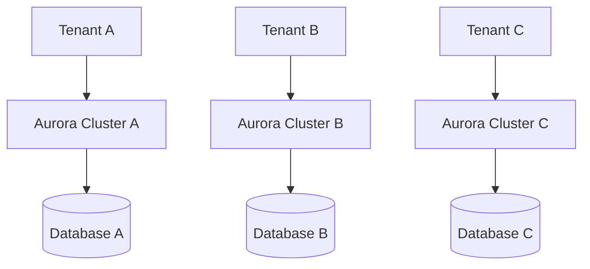
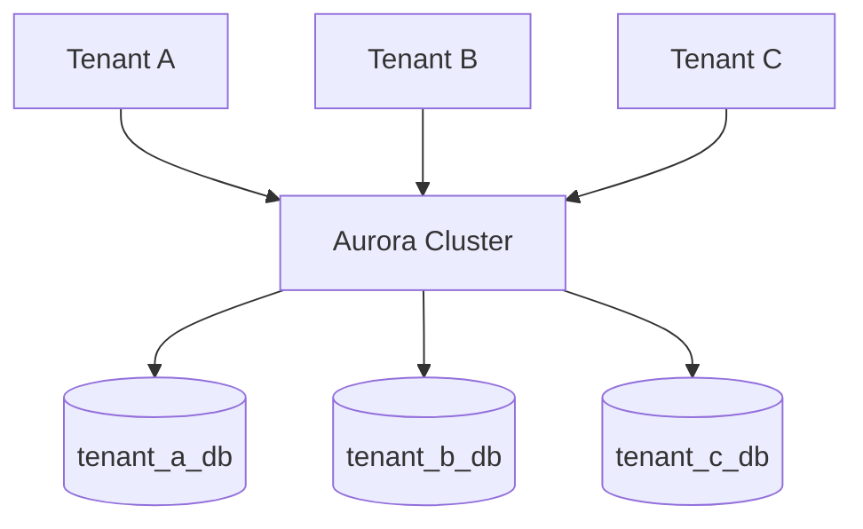
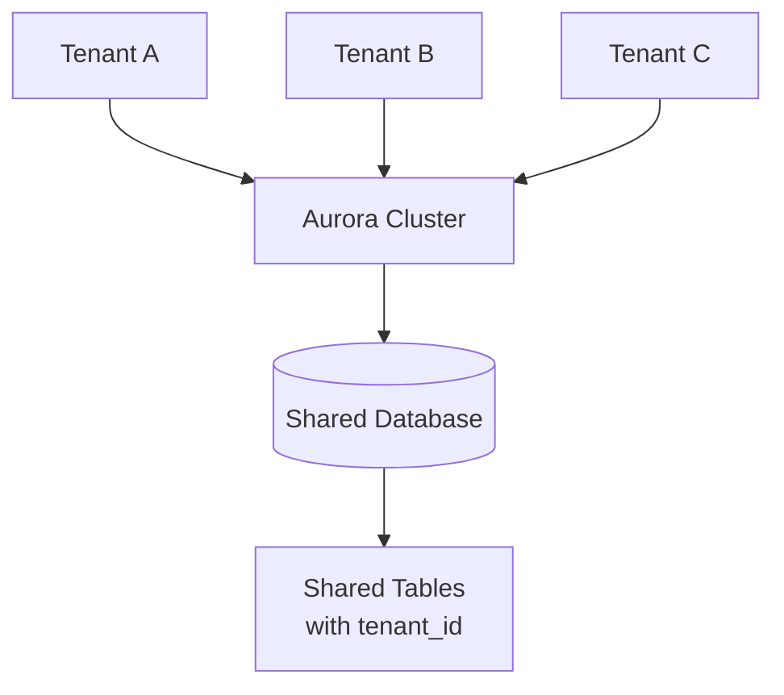

# Aurora Provisioned vs Serverless V2 for Multi-Tenant SaaS: A Complete Guide to Bridge Database Architecture

## Introduction

Building a scalable multi-tenant SaaS application requires careful consideration of your database architecture. The wrong choice can lead to security vulnerabilities, performance bottlenecks, operational complexity, and runaway costs. Amazon Aurora offers two compelling deployment options—Provisioned and Serverless V2—each with distinct advantages for multi-tenant workloads.

The Bridge database model has emerged as a popular middle-ground approach for multi-tenant SaaS applications. It provides strong tenant isolation by giving each tenant a separate PostgreSQL database while sharing the underlying Aurora cluster infrastructure. This approach balances the security benefits of complete isolation (silo model) with the cost efficiency of shared resources (pool model).

In this comprehensive guide, we'll explore how Aurora Provisioned and Serverless V2 compare when implementing the Bridge model, analyze the trade-offs through the AWS Well-Architected Framework, and provide practical implementation guidance for your multi-tenant SaaS architecture.

## Understanding Aurora Deployment Options

### Aurora Provisioned

Aurora Provisioned clusters use fixed-size database instances that you select and manage. You choose specific instance classes (like db.r6g.large or db.r6g.xlarge) and pay for the allocated capacity 24/7, regardless of actual utilization.

**Key Characteristics:**
- **Fixed Capacity**: Instance size remains constant until manually changed
- **Predictable Costs**: Consistent hourly charges based on instance class
- **Manual Scaling**: Requires intervention to add/remove instances or change sizes
- **Reserved Instance Discounts**: Up to 66% savings with 1-3 year commitments
- **Full Feature Set**: Access to all Aurora features and configurations

**Best For:**
- Predictable, steady workloads
- Applications requiring consistent performance
- Cost-sensitive scenarios with reserved instance commitments
- Workloads needing specific instance configurations

### Aurora Serverless V2

Aurora Serverless V2 automatically scales database capacity up and down based on application demand. Instead of fixed instances, you set minimum and maximum Aurora Capacity Units (ACUs), and the service adjusts capacity in real-time.

**Key Characteristics:**
- **Incremental Scaling**: Unlike Serverless v1 which doubles capacity, v2 scales incrementally starting from 0.5 ACU increments. Larger current capacity enables larger scaling increments for faster scaling
- **Pay-per-Use**: Charged only for consumed capacity per second
- **Rapid Scaling**: Fast capacity adjustments with no downtime or connection drops (scaling speed depends on current capacity, with faster scaling at higher ACUs)
- **Pause Capability**: Can scale to zero during idle periods (note: resuming from 0 ACUs incurs a cold-start delay of 5-15 seconds, making this feature best suited for development or non-critical workloads. Open connections, such as those from RDS Proxy, prevent auto-pause)
- **Simplified Management**: No instance sizing decisions required
- **Resource Mapping**: Each ACU provides approximately 2 GiB of memory with connection limits typically defaulting to 2000 (capped when minimum ACU is 0 or 0.5)

**Best For:**
- Variable or unpredictable workloads
- Development and testing environments
- Applications with significant idle periods
- Multi-tenant scenarios with diverse usage patterns

## The Multi-Tenant Bridge Database Model

### Multi-Tenant Architecture Comparison

#### Silo Model
Each tenant has a dedicated database instance with complete isolation:



#### Bridge Model
Multiple tenants share cluster infrastructure but maintain separate databases:



#### Pool Model
All tenants share the same database with tenant identification in shared tables:



### Architecture Overview

The Bridge model creates a separate PostgreSQL database for each tenant within a single Aurora cluster. This approach provides:

- **Strong Data Isolation**: Each tenant's data resides in a completely separate database
- **Shared Infrastructure**: All tenant databases share the same Aurora cluster resources
- **Simplified Operations**: One cluster to manage instead of multiple separate instances
- **Cost Efficiency**: Shared infrastructure costs across all tenants

```
Aurora Cluster
├── tenant_1_db (Database)
├── tenant_2_db (Database)  
├── tenant_3_db (Database)
└── tenant_n_db (Database)
```

### How It Works

1. **Tenant Onboarding**: Create a new PostgreSQL database for each tenant
2. **Application Routing**: Route tenant requests to their specific database
3. **Access Control**: Use database-level permissions and separate credentials
4. **Resource Sharing**: All databases share cluster CPU, memory, and storage

### Implementation Example

```sql
-- Create first tenant database
CREATE DATABASE tenant_acme_corp;
CREATE USER acme_user WITH PASSWORD 'secure_password';
GRANT ALL PRIVILEGES ON DATABASE tenant_acme_corp TO acme_user;

-- Create second tenant database  
CREATE DATABASE tenant_globex_inc;
CREATE USER globex_user WITH PASSWORD 'secure_password';
GRANT ALL PRIVILEGES ON DATABASE tenant_globex_inc TO globex_user;

-- Set up first tenant schema
\c tenant_acme_corp
CREATE SCHEMA app_data;
GRANT ALL ON SCHEMA app_data TO acme_user;

-- Set up second tenant schema
\c tenant_globex_inc
CREATE SCHEMA app_data;
GRANT ALL ON SCHEMA app_data TO globex_user;
```

## Well-Architected Framework Analysis

Let's examine how Aurora Provisioned and Serverless V2 compare across the six Well-Architected Framework pillars when implementing the Bridge model.

### Operational Excellence

#### Aurora Provisioned
**Strengths:**
- **Predictable Operations**: Fixed capacity means consistent performance characteristics
- **Mature Tooling**: Extensive monitoring and management tools available
- **Familiar Operations**: Standard database scaling, backup, and maintenance procedures

**Challenges:**
- **Manual Capacity Management**: Requires monitoring and manual scaling decisions
- **Over-provisioning Risk**: Must size for peak load, leading to idle capacity
- **Complex Tenant Onboarding**: Adding tenants may require capacity planning

#### Aurora Serverless V2
**Strengths:**
- **Automated Capacity Management**: No need to provision for peak or average capacity manually
- **Simplified Tenant Onboarding**: Add tenants without immediate capacity concerns
- **Reduced Operational Overhead**: Focus on application development rather than scaling schedules

**Challenges:**
- **Less Predictable Behavior**: Scaling events may require monitoring and tuning
- **Different Monitoring Requirements**: Requires understanding new metrics like ACU utilization and scaling patterns

The choice between these approaches depends on your team's operational preferences and workload characteristics. Provisioned offers predictability and established practices, while Serverless V2 provides automation at the cost of some operational complexity.

### Security

#### Aurora Provisioned
**Strengths:**
- **Predictable Resource Allocation**: Fixed capacity prevents resource-based side-channel attacks
- **Extensive Audit Capabilities**: Comprehensive logging and monitoring options
- **Established Security Patterns**: Well-documented security configurations and hardening guides

**Challenges:**
- **Shared Network Exposure**: Opening cluster port exposes all tenant databases to the same network access
- **Limited Firewall Granularity**: Cannot implement database-level network restrictions within the cluster
- **Connection Management Complexity**: Multiple databases require sophisticated connection handling
- **Credential Management**: Each tenant database needs separate credentials and rotation

#### Aurora Serverless V2
**Strengths:**
- **Comprehensive Security Features**: Most Aurora Provisioned security capabilities with some exceptions (Database Activity Streams not currently supported)
- **IAM Database Authentication**: Supports modern authentication patterns
- **Transparent Scaling**: Scaling events don't affect security boundaries

**Challenges:**
- **Shared Resource Concerns**: Dynamic scaling might introduce timing-based vulnerabilities
- **Connection Pool Complexity**: Autoscaling can complicate connection management

Both options provide equivalent security capabilities with proper implementation, though Serverless V2 has some feature limitations like Database Activity Streams.

### Reliability

#### Aurora Provisioned
**Strengths:**
- **Predictable Performance**: Fixed capacity provides consistent response times
- **Proven Reliability**: Mature technology with established reliability patterns
- **Resource Guarantees**: Allocated capacity is always available

**Challenges:**
- **Capacity Constraints**: Fixed resources can become bottlenecks during spikes
- **Manual Intervention**: Scaling requires human intervention and potential downtime

#### Aurora Serverless V2
**Strengths:**
- **Dynamic Scaling**: Automatically handles traffic spikes without manual intervention
- **Improved Fault Tolerance**: Can scale up to handle increased load from failures
- **Reduced Capacity-Related Outages**: Automatic scaling reduces capacity-related incidents (note: true fault tolerance requires Multi-AZ deployment)

**Challenges:**
- **Scaling Limits**: Maximum ACU limits could constrain very large spikes
- **Complexity**: More moving parts in the scaling mechanism

Dynamic scaling significantly improves reliability for variable workloads, while provisioned instances offer predictable performance guarantees.

**Mixed Configuration Options**: Aurora clusters can combine provisioned writers with Serverless V2 readers, providing a migration path and cost optimization for read-heavy workloads.

**Global Database for DR**: Aurora Global Database enables cross-region disaster recovery with Serverless V2 readers in secondary regions, enhancing overall reliability for multi-tenant applications.

### Performance Efficiency

#### Aurora Provisioned
**Strengths:**
- **Consistent Performance**: Fixed resources provide predictable performance characteristics
- **Optimized for Steady State**: Excellent performance for consistent workloads
- **No Scaling Overhead**: No performance impact from scaling operations

**Challenges:**
- **Resource Waste**: Idle capacity during low-usage periods
- **Noisy Neighbor Issues**: Heavy tenants can impact others with fixed resources
- **Manual Optimization**: Requires manual tuning for optimal performance

#### Aurora Serverless V2
**Strengths:**
- **Dynamic Resource Allocation**: Automatically adjusts to workload demands
- **Improved Resource Utilization**: Scales down during idle periods
- **Tenant Impact Mitigation**: Can scale up to handle heavy tenant workloads, though doesn't eliminate noisy neighbor risks entirely

**Challenges:**
- **Scaling Latency**: Brief delays during scaling events
- **Cost per ACU**: Slightly higher unit cost than equivalent provisioned capacity

Dynamic scaling provides better overall performance efficiency for multi-tenant workloads, though provisioned instances excel at consistent performance delivery.

### Cost Optimization

#### Aurora Provisioned
**Strengths:**
- **Reserved Instance Savings**: Up to 66% cost reduction with long-term commitments
- **Predictable Costs**: Fixed monthly expenses for budgeting
- **Lower Unit Costs**: Cheaper per-hour for consistent high utilization

**Challenges:**
- **Idle Capacity Costs**: Pay for unused capacity during low-usage periods
- **Over-provisioning**: Must size for peak load across all tenants
- **Scaling Costs**: Adding capacity requires full instance increments

#### Aurora Serverless V2
**Strengths:**
- **Pay-per-Use**: Only pay for consumed capacity
- **Automatic Scaling**: Eliminates idle capacity costs
- **Fine-grained Scaling**: 0.5 ACU increments provide precise capacity matching

**Challenges:**
- **Higher Unit Costs**: More expensive than reserved instances for steady workloads
- **Unpredictable Costs**: Variable costs based on actual usage

For most multi-tenant scenarios with variable usage patterns, Serverless V2 provides significant cost advantages through pay-per-use pricing and automatic scaling.

**I/O-Optimized Consideration**: Aurora I/O-Optimized can be more cost-effective when I/O costs represent approximately 25% or more of your total Aurora spend, providing predictable pricing for I/O-intensive multi-tenant workloads.

### Sustainability

#### Aurora Provisioned
**Strengths:**
- **Efficient at Scale**: Good resource utilization for consistent high-load scenarios
- **Mature Optimization**: Well-understood efficiency patterns

**Challenges:**
- **Idle Resource Waste**: Unused capacity consumes energy unnecessarily
- **Over-provisioning**: Environmental impact of running oversized infrastructure

#### Aurora Serverless V2
**Strengths:**
- **Dynamic Efficiency**: Only consumes resources when needed
- **Reduced Waste**: Eliminates idle capacity environmental impact
- **Optimal Utilization**: Matches resource consumption to actual demand

**Challenges:**
- **Scaling Overhead**: Some energy cost for scaling operations

Serverless V2 better aligns with sustainability goals through more efficient resource usage, though both options can be optimized for environmental impact.

## Implementation Recommendations

### When to Choose Aurora Provisioned

**Ideal Scenarios:**
- Predictable, steady workloads with consistent resource needs
- Budget-constrained environments where reserved instance savings are crucial
- Applications requiring specific instance configurations or features
- Workloads with strict performance SLA requirements

**Implementation Tips:**
- Use Reserved Instances for 1-3 year commitments to maximize savings
- Implement robust monitoring to detect when scaling is needed
- Consider read replicas for read-heavy multi-tenant workloads
- Plan capacity carefully to avoid over-provisioning

### When to Choose Aurora Serverless V2

**Ideal Scenarios:**
- Variable or unpredictable tenant usage patterns
- Development, testing, or staging environments
- Applications with significant idle periods
- Multi-tenant SaaS with diverse tenant sizes and usage patterns

**Implementation Tips:**
- Set appropriate minimum ACU to ensure responsiveness
- Configure maximum ACU to control costs and prevent runaway scaling
- Monitor scaling patterns to optimize ACU ranges
- Use RDS Proxy for efficient connection management (note: RDS Proxy maintains persistent connections that prevent auto-pause to 0 ACUs)

### Bridge Model Best Practices

#### Security Implementation
```sql
-- Create tenant-specific roles
CREATE ROLE tenant_admin;
CREATE ROLE tenant_user;

-- Grant appropriate permissions
GRANT CONNECT ON DATABASE tenant_db TO tenant_user;
GRANT USAGE ON SCHEMA app_data TO tenant_user;
GRANT SELECT, INSERT, UPDATE, DELETE ON ALL TABLES IN SCHEMA app_data TO tenant_user;
```

#### Connection Management
```python
# Example connection routing logic
def get_tenant_connection(tenant_id):
    database_name = f"tenant_{tenant_id}_db"
    return psycopg2.connect(
        host=AURORA_ENDPOINT,
        database=database_name,
        user=f"tenant_{tenant_id}_user",
        password=get_tenant_password(tenant_id)
    )
```

#### Monitoring and Alerting
- Monitor per-tenant resource usage
- Set up alerts for unusual scaling patterns
- Track connection counts per tenant database
- Monitor autovacuum performance across databases

#### Operational Guardrails
- **Per-Tenant Safeguards**: Configure `statement_timeout` and `idle_in_transaction_session_timeout` to prevent runaway queries
- **Application-Layer Controls**: Implement rate limiting and connection pooling per tenant
- **Database Observability**: Use `pg_stat_database` and `pg_stat_statements` combined with ACU metrics (`ServerlessDatabaseCapacity`, `ACUUtilization`) for comprehensive monitoring
- **Connection Planning**: Note that `max_connections` is derived from memory and effectively tied to max ACU configuration

### Common Pitfalls to Avoid

1. **Inadequate Connection Pooling**: Use RDS Proxy or application-level pooling
2. **Poor Tenant Isolation**: Implement proper database-level security
3. **Ignoring Autovacuum**: Monitor and tune vacuum settings for multiple databases
4. **Insufficient Monitoring**: Track both cluster and tenant-level metrics
5. **Over-provisioning ACUs**: Start conservative and adjust based on actual usage

## Backup and Recovery in Multi-Tenant Bridge Architecture

Database backup and recovery is critical for SaaS applications, but multi-tenant architectures introduce unique challenges. The Bridge model strikes a balance between operational complexity and tenant isolation, requiring specific strategies for effective backup and recovery operations.

**Summary**: The Bridge model offers moderate backup complexity compared to silo (simple) and pool (complex) models. Two main approaches exist: segregating tenant data during backup (faster recovery, higher operational overhead) or during recovery (operationally efficient, temporary costs). Aurora Serverless V2 provides cost advantages through automatic scaling and pay-per-use pricing for backup operations.

### Multi-Tenant Backup Complexity Comparison

Understanding how backup complexity varies across multi-tenant models helps contextualize the Bridge approach:

**Silo Model (Lowest Complexity)**
- Each tenant has dedicated database instance/cluster
- Standard backup procedures with no segregation required
- Simple point-in-time recovery per tenant
- Higher infrastructure costs but minimal operational overhead

**Bridge Model (Moderate Complexity)**
- Multiple tenant databases on shared Aurora cluster
- Requires database-specific tools for tenant data segregation
- Balances operational efficiency with tenant isolation
- Good compromise between cost and complexity

**Pool Model (Highest Complexity)**
- All tenants share same database and tables
- Complex data segregation across shared tables
- Requires custom logic for tenant data extraction
- Most cost-effective but operationally intensive

### Bridge Model Backup Strategies

The Bridge model offers two primary approaches for tenant backup and recovery, each with distinct trade-offs:

#### Approach 1: Segregation During Backup

This approach creates individual backups for each tenant database during the backup process.

**Advantages:**
- **Faster Recovery**: Direct restoration from tenant-specific backups
- **Per-Tenant Retention**: Individual retention policies and encryption keys
- **Simplified Compliance**: Easier data deletion for regulatory requirements
- **Cost Transparency**: Clear per-tenant backup costs

**Challenges:**
- **Operational Overhead**: Backup process scales with tenant count
- **Performance Impact**: Multiple backup operations during backup window
- **Storage Costs**: Individual backup files for each tenant

**Implementation Example:**
```bash
# Create individual tenant backups
for tenant_db in $(psql -h $AURORA_ENDPOINT -t -c "SELECT datname FROM pg_database WHERE datname LIKE 'tenant_%'"); do
    pg_dump -h $AURORA_ENDPOINT -U $DB_USER -Fc $tenant_db > "backups/${tenant_db}_$(date +%Y%m%d_%H%M%S).dump"
done
```

#### Approach 2: Segregation During Recovery

This approach uses Aurora's native backup features and segregates tenant data only during recovery operations.

**Advantages:**
- **Operational Efficiency**: Single backup process for entire cluster
- **Aurora Native Features**: Leverages continuous, incremental backups
- **No Performance Impact**: Backup operations don't affect application performance
- **Cost Effective**: Single backup storage for all tenants

**Challenges:**
- **Recovery Complexity**: Requires temporary database for data extraction
- **Temporary Costs**: Additional compute costs during recovery operations
- **Longer Recovery Time**: Multi-step process for tenant restoration

**Implementation Example:**
```bash
# 1. Restore entire cluster to temporary instance
aws rds restore-db-cluster-to-point-in-time \
    --source-db-cluster-identifier production-cluster \
    --db-cluster-identifier temp-recovery-cluster \
    --restore-to-time 2024-01-15T10:00:00Z

# 2. Extract specific tenant data
pg_dump -h temp-recovery-cluster.cluster-xyz.region.rds.amazonaws.com \
    -U recovery_user -Fc tenant_acme_corp > tenant_acme_recovery.dump

# 3. Restore to production (connecting to different database)
pg_restore -h production-cluster.cluster-abc.region.rds.amazonaws.com \
    -U admin_user --create --clean --if-exists -d postgres tenant_acme_recovery.dump

# 4. Clean up temporary cluster
aws rds delete-db-cluster --db-cluster-identifier temp-recovery-cluster
```

### Aurora Serverless V2 vs Provisioned for Backup Operations

The choice between Aurora deployment options affects backup and recovery operations:

#### Aurora Provisioned
**Backup Advantages:**
- **Predictable Performance**: Consistent backup completion times
- **Resource Guarantees**: Dedicated capacity for backup operations
- **Established Patterns**: Well-understood backup scheduling

**Recovery Considerations:**
- **Fixed Capacity**: May need manual scaling for large recovery operations
- **Cost Predictability**: Known costs for temporary recovery instances

#### Aurora Serverless V2
**Backup Advantages:**
- **Automatic Scaling**: Handles backup load spikes automatically
- **Cost Efficiency**: Pay only for backup processing time
- **Simplified Management**: No capacity planning for backup operations

**Recovery Considerations:**
- **Dynamic Scaling**: Automatically adjusts capacity for recovery operations
- **Cost Optimization**: Temporary recovery clusters scale to zero when idle
- **Faster Recovery**: Can scale up quickly for large data restoration

**Serverless V2 Recovery Cost Optimization:**
```bash
# Create temporary Serverless V2 cluster for recovery
aws rds create-db-cluster \
    --db-cluster-identifier temp-recovery-cluster \
    --engine aurora-postgresql \
    --serverless-v2-scaling-configuration MinCapacity=0.5,MaxCapacity=2.0 \
    --master-username recovery_admin

# Cluster automatically scales down to 0.5 ACU when idle
# Scales up to 2.0 ACU during active recovery operations
```

### Best Practices for Bridge Model Backup and Recovery

#### Backup Strategy Selection
- **High-Tenant-Count SaaS**: Use segregation during recovery to minimize operational overhead
- **Compliance-Heavy Industries**: Consider segregation during backup for per-tenant retention
- **Development/Testing**: Leverage Serverless V2 auto-pause for cost-effective recovery testing

#### Implementation Guidelines
```sql
-- Create backup-specific user with minimal privileges
CREATE USER backup_user WITH PASSWORD 'secure_backup_password';
GRANT CONNECT ON DATABASE tenant_acme_corp TO backup_user;
GRANT USAGE ON SCHEMA app_data TO backup_user;
GRANT SELECT ON ALL TABLES IN SCHEMA app_data TO backup_user;

-- Create recovery validation function
CREATE OR REPLACE FUNCTION validate_tenant_recovery(tenant_name text)
RETURNS boolean AS $$
DECLARE
    table_count integer;
    record_count integer;
BEGIN
    -- Validate database exists and has expected structure
    SELECT COUNT(*) INTO table_count 
    FROM information_schema.tables 
    WHERE table_schema = 'app_data';
    
    IF table_count = 0 THEN
        RETURN false;
    END IF;
    
    -- Add additional validation logic as needed
    RETURN true;
END;
$$ LANGUAGE plpgsql;
```

#### Monitoring and Alerting
- **Backup Success Rates**: Monitor per-tenant backup completion
- **Recovery Time Objectives**: Track recovery performance metrics
- **Cost Monitoring**: Alert on unexpected temporary cluster costs
- **Data Consistency**: Validate backup integrity regularly

### Recovery Testing and Validation

Regular recovery testing is essential for multi-tenant applications:

```bash
#!/bin/bash
# Automated recovery testing script
TENANT_DB="tenant_test_corp"
BACKUP_FILE="test_backups/${TENANT_DB}_latest.dump"

# 1. Create test recovery database
createdb -h $AURORA_ENDPOINT -U $DB_USER "${TENANT_DB}_recovery_test"

# 2. Restore from backup
pg_restore -h $AURORA_ENDPOINT -U $DB_USER -d "${TENANT_DB}_recovery_test" $BACKUP_FILE

# 3. Validate data integrity
psql -h $AURORA_ENDPOINT -U $DB_USER -d "${TENANT_DB}_recovery_test" \
    -c "SELECT validate_tenant_recovery('${TENANT_DB}');"

# 4. Clean up test database
dropdb -h $AURORA_ENDPOINT -U $DB_USER "${TENANT_DB}_recovery_test"
```

For comprehensive guidance on multi-tenant backup and recovery strategies, including detailed implementation examples and cost optimization techniques, refer to the AWS blog post: **[Managed database backup and recovery in a multi-tenant SaaS application](https://aws.amazon.com/blogs/database/managed-database-backup-and-recovery-in-a-multi-tenant-saas-application/)**.

## Migration Strategies

### From Provisioned to Serverless V2
1. **Assessment**: Analyze current usage patterns and costs
2. **Testing**: Create Serverless V2 cluster in non-production environment
3. **Configuration**: Set appropriate ACU ranges based on historical data
4. **Migration**: Use Aurora's built-in migration tools or blue-green deployment
5. **Optimization**: Monitor and adjust ACU settings post-migration

### From Single-Tenant to Bridge Model
1. **Planning**: Design tenant database naming and routing strategy
2. **Migration Scripts**: Create automation for tenant database creation
3. **Application Updates**: Modify connection logic for multi-database routing
4. **Data Migration**: Move existing tenant data to separate databases
5. **Validation**: Ensure proper tenant isolation and functionality

## Additional Resources

For deeper insights into multi-tenant SaaS architecture patterns and AWS best practices, refer to these official AWS documentation resources:

### AWS Well-Architected SaaS Lens
- **[Silo, Pool, and Bridge Models](https://docs.aws.amazon.com/wellarchitected/latest/saas-lens/silo-pool-and-bridge-models.html)** - Comprehensive overview of the three primary SaaS architectural patterns, including detailed analysis of the Bridge model approach used in this guide.

- **[Multi-tenant Microservices](https://docs.aws.amazon.com/wellarchitected/latest/saas-lens/multi-tenant-microservices.html)** - Best practices for implementing tenant context and isolation in microservices architectures.

### AWS Prescriptive Guidance
- **[Multi-tenant SaaS Partitioning Models for PostgreSQL](https://docs.aws.amazon.com/prescriptive-guidance/latest/saas-multitenant-managed-postgresql/partitioning-models.html)** - Detailed comparison of PostgreSQL partitioning strategies for multi-tenant applications.

- **[Selecting a Database for a SaaS Application](https://docs.aws.amazon.com/prescriptive-guidance/latest/saas-multitenant-managed-postgresql/db-selection.html)** - Decision framework for choosing between Aurora and Amazon RDS for multi-tenant SaaS applications.

- **[Design Models for Multi-tenant SaaS Architectures](https://docs.aws.amazon.com/prescriptive-guidance/latest/saas-multitenant-api-access-authorization/design-models.html)** - Architectural patterns for implementing access control and authorization in multi-tenant systems.

### Multi-tenant Best Practices
- **[Multi-tenant Application Best Practices - Amazon Cognito](https://docs.aws.amazon.com/cognito/latest/developerguide/multi-tenant-application-best-practices.html)** - Scaling considerations and quota management for multi-tenant applications using Amazon Cognito.

- **[Managed Database Backup and Recovery in a Multi-tenant SaaS Application](https://aws.amazon.com/blogs/database/managed-database-backup-and-recovery-in-a-multi-tenant-saas-application/)** - Comprehensive guide to backup and recovery strategies across silo, bridge, and pool models with practical PostgreSQL examples.

## Conclusion

The choice between Aurora Provisioned and Serverless V2 for multi-tenant Bridge architecture depends on your specific requirements:

**Choose Aurora Serverless V2 if:**
- You have variable or unpredictable tenant usage patterns
- Cost optimization is a priority for multi-tenant workloads
- You want to minimize operational overhead
- Your application can benefit from automatic scaling

**Choose Aurora Provisioned if:**
- You have predictable, steady workloads
- You can commit to reserved instances for cost savings
- You need specific instance configurations or features
- You require maximum performance predictability

For most multi-tenant SaaS applications, **Aurora Serverless V2 with the Bridge model provides the optimal balance** of cost efficiency, operational simplicity, and performance scalability. The automatic scaling capabilities address the traditional challenges of the Bridge model while maintaining strong tenant isolation.

### Next Steps

1. **Assess Your Workload**: Analyze current usage patterns and tenant characteristics
2. **Prototype**: Build a proof-of-concept with your preferred Aurora option
3. **Monitor and Optimize**: Implement comprehensive monitoring and adjust configurations
4. **Plan for Growth**: Design tenant onboarding and scaling procedures
5. **Consider Hybrid Approaches**: Use different models for different tenant tiers

The Bridge model with Aurora Serverless V2 represents a mature, cost-effective approach to multi-tenant SaaS architecture that can scale with your business while maintaining the security and isolation your customers expect.

---

*This post was co-authored by Mladen Trampic and Amazon Q Developer, demonstrating the collaborative approach to technical content creation.*
